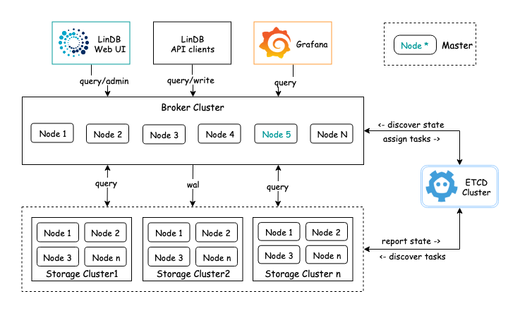

# 架构

## 前言

LinDB 诞生于饿了么，服务于整个技术中心，存储监控系统中的时间序列指标，包括网络、硬件、中间件、容器、网关、框架、业务、前端等监控指标，实现了海量数据的存储与计算平台。
相比较开源TSDB与其他大数据分析系统，LinDB具有以下优势。

- 足够简单，包括使用及可运维性，只依赖ETCD，一个二进制文件可以选择单机和分布式运行；
- 支持分布式集群，拥有良好的水平拓展能力；
- 支持多副本，保证高可用，在仅剩下一个副本的场景下仍然能对外提供服务；
- 支持多IDC，支持单机房写入、多机房聚合查询;
- 最终一致性，追求低延时、可拓展性的必然选择；
- 有一定的自监控能力，快速failover；
- 有一定的自治理能力，防御恶意用户；

## 概览

LinDB 分布式时间序列数据库采用了计算、存储分离的设计，分为3个大模块，每个模块之间互相通信。

这三个模块分别是 Broker、Storage、ETCD

### 计算层

Broker，是一个无状态的服务，具有水平扩容能力。
其中，Master 是承担特殊职责的节点，所有的 Metadata 变更均由 Master 来完成，以保证一致性，Master 可以从任一 Broker 节点中抢占式选举产生。

Broker 的主要职责如下：
1. 负载均衡：由于自身无状态，可以启动多个实例，因此接入层的连接可以均匀的分摊到所有 Broker 节点上进行读写；
2. WAL复制： 由Master节点负责将相应的WAL日志复制到对应的Slave节点；
3. 分布式查询：根据具体的查询情况生成不同的执行计划；
4. 查询结果聚合：作为计算层聚合 Broker（中间查询）/Storage 查询返回的数据；
5. 跨机房查询结果聚合：多IDC查询结果的再聚合；

### 存储层

Storage， 也是一个无状态的服务，只存储实际的数据，不存储整个 Storage 集群的 Metadata，因此也具有水平扩展的能力。主要职责如下：
1. 写入：存储各database下的数据及索引，以及自己的 Metadata；
2. 读取：执行数据的过滤及一些简单的聚合操作(最原子的field基本类型的聚合计算)；
3. DDL：执行 Broker 下发的 Metadata 变更任务，如创建数据库，数据治理等；
4. 自监控：定期上报自身服务的状态；

### 元信息系统层

ETCD是 LinDB 的唯一外部依赖，ETCD 也是一个弱依赖，即在不可用的情况下，LinDB 集群仍然可以提供服务。

ETCD 主要职责如下：
1. 元数据存储：如数据库的配置，各分片的信息，Broker/Storage 集群各节点的状态；
2. 分布式调度：即所有的 Metadata 的变更都通过 ETCD 中转下发到 Storage 节点；

实现弱依赖的前置条件：
1. 当 ETCD 出问题的时候，不存在 Metadata 信息的变更，如不修改数据库的配置等；
2. 集群状态是健康的，即还是可以使用当前的 Metadata/Status 来协调整个集群；

一定的自修复能力：当 ETCD 中的数据完整不可用或者丢失时，Broker/Storage 可以上报 Metadata/Status 到新的 ETCD 集群以实现故障转移；