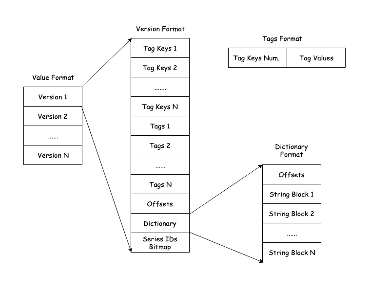

# Index

## 反向

TBD

## 正向

反向索引主要用于根据查询条件过滤Tags找到对应的 Series ID，但是不能很好的解决 Group By 查询时通过 Series ID 找到对应 Tags， 再进行分组，所以需要一个正向的存储来解决这类问题。

正向的主要作用如下：
- 解决 Group By 分组的问题；
- 可以通过正向来重建反正的索引；

正向数据存储和数据存储很相似，数据存储是 Series ID => Data Points，而正向存储是 Series ID => Tags， 其中Series ID在两边的数据是一样的，所以能很好的解决根据实际查询结果的 Series ID 来找对应的 Tags。

所有的正向数据也存储在底层通过的 KV Store，即 Key => Metric ID， Value => Tags Set，把一个 Metric 下所有的正向数据放在一个 KV 里面，Value 的存储通过 Dictionary + Bitmap 的方式，方便查询的同时可以减少实际的存储成本。

具体 Value 的格式如下：

- 第一层: 多个 Version 的数据，每个 Version 包括当前 Version No. + Offsets， 这里的 Offsets 主要存储指向 Series IDs Bitmap，Dictionary，Offsets 及 第一个 Tags 的 offset；
- 第二层: 一个 Version 对应的数据格式如下；
    1. Series IDs Bitmap: 存储了所有 Series IDs，所以 Series ID 查询的时候，通过该 Bitmap 直接定位到 Offsets 的 Index，即有过滤又有定位的效果；
    2. Offsets: 每个 Offset 需要固定长度存储，结合上面得到的 Index 就可以找到实际 Tags Offset，例如，第个 Offset 的存储宽度为 3 Byte，要找第 100 的 Index 的真实 Offset 是多少，即 skip 3*100 之后取 3 bytes 就是真实的 Tags Offset；
    3. Tag Keys: 存储当前 Metric 下所有 Tag Keys 的组合，并为每个组合生成一个 Sequence，因为 Metric 下面 tag keys 正常都是固定的，即使有变化一般也不会很多，不需要每个 tags 存储一样的 tag keys，还有一个好处是可以通过 tag keys 来简单过滤一下查询想要的 tag key 有没有在里面，如果没有就直接返回，如果存在找到在第几个位置，然后取第几个位置的 tag value 就可以了；
    4. Tags: 存储了在 Dictionary 中第几个位置的组合，如 Tags => {host=1.1.1.1, region=sh} 实际编码就是 tag keys=> 10(tag keys seq:10=>1,3)  tag values=> 2,4 即 1=>host, 2=>1.1.1.1, 3=>region, 4=>sh，可以看出 tag keys 和 tag values 是分开存储，即 {10,2,4} 。
- 第三层: Dictionary, 因为真实的每个 Tag 的组合都是 string 并且很多都是重复的 string, 如果直接用 string 来存储 tags 的数据，存储会很浪费，所以需要一个 Dictionary 来存储 string => sequence 的关系， sequence 为当前 Dictionary 中每个 string 的编码，并且是递增型的，可以按一组 string 为一个单位放在一个 block 中，一个 string block 可以做一个压缩处理。由于 seqeunce 是递增类型的，所以实际不需要存储这个数据，只需要存储每个 string 的 offset 就可以了，这里的 offset 有 2 块，一个为 string block 的 offset，还有一个是在 string block 中的 offset，如每个 offset 为 2 bytes， 拿上面那个例子要找 3=>region 这个数据，skip (2+2)*3 之后取 4 bytes 就是真实数据的 offset 再通过该 offset 来取真实的 string 值。