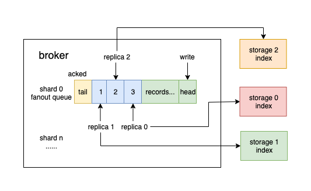

# 副本

client 通过 tcp或 http 协议将时序数据（包含 database、metric name、tags、timestamp、fields 信息）发送到 broker，broker 首先判断 database 是否存在，如果存在根据 metric name、tags、database 配置的 shard 总数计算所属的 shard，然后将数据写入到 shard 相应内存缓存中，当缓存大小超过限制或离上一次写入时间超过限制，缓存中的数据作为一条 record 追加到当前 shard 所属的磁盘日志文件中。

一个 shard 依据配置的备份数会对应一个或多个物理的 storage 节点，broker 查询 etcd 中数据了解到这些信息，通过 rpc 将 shard 日志文件中 record 有序的复制到对应的 storage 节点。依据目前的设计，storage 直接将 record 数据写入到内存中，不会再额外写 wal。等内存中数据写入磁盘后，通过 rpc 通知 broker 这部分数据已经完全消费。broker 等所有storage 节点完成确认后删除磁盘文件。

一个 shard 的复制过程可以抽象为 Fanout queue 的生产和消费过程，实现时借鉴了 [bigqueue](https://github.com/bulldog2011/bigqueue)，broker 将写入的数据计算 shard，累计成批后写入 Fanout queue，异步 go routine 负责将数据推送到对应的 storage 节点，storage 确认成功消费的数据记录。broker 删除被所有 storage 确认消费的 queue 文件。

时序数据库对数据写入的顺序没有要求，只要数据最终都完成写入，查询的结果是一致的，broker 向 storage 复制时保持顺序性是为了依靠顺序性处理各种异常场景，保证数据准确地复制到 storage。

Broker处理流程：

1. broker 询问 storage 消费 record 的 index ，如果 index 对 broker 有效（未超过 broker 当前写入的 head index，大于 broker 已经确认的 tail index），进入第 3 步，否则进入第 2 步

2. 以 broker index 重置 storage index，进入第 3 步

3. broker 从 index 开始复制数据到 storage，如果出现异常回到第 1 步

Storage处理流程：

1. 响应 broker 查询，重置 record index 请求

2. 接收 broker 复制推送的 record，检测 record index 和 storage index是否一致，一致则返回正常，index 自增 1，否则返回错误
